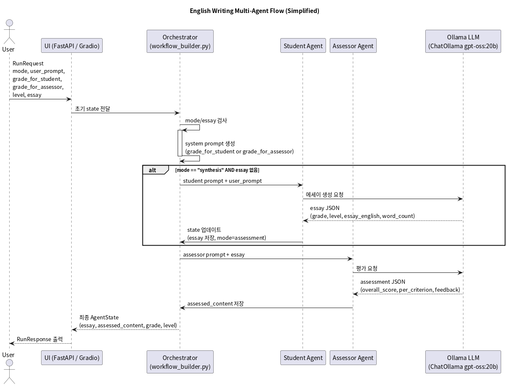
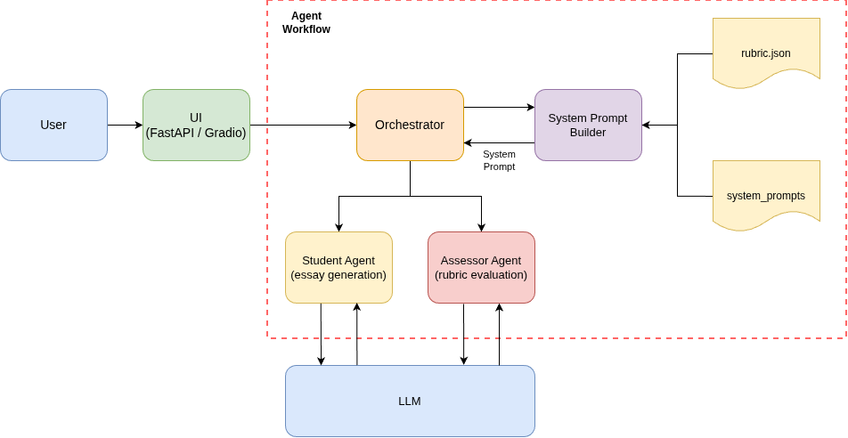

# Multi Agent English Assessment System (포트폴리오 프로젝트)

## 개요

- 영어 에세이를 **생성하고 평가**하는 멀티 에이전트 시스템입니다.
- LangGraph 위에 Student / Assessor / Orchestrator 에이전트를 올려, 학년(grade)과 수준(level)에 맞는 글을 쓰고 루브릭 기반으로 평가합니다.
- **포트폴리오용**으로 정리한 개인 프로젝트이며, **이전 직장에서 실제로 운영했던 영어 쓰기 평가 시스템을 단순화해서 재구성**한 버전입니다.  
  (실제 서비스에서 사용하던 코드나 데이터는 포함되어 있지 않고, 아이디어와 구조만 복원했습니다.)
- 모든 LLM 호출은 **Ollama + langchain-ollama** 를 통해 이루어지며, 로컬에서 **무료로 사용할 수 있는 gpt-oss:20b** 모델을 기본으로 사용합니다.

## 주요 기능

- 영어 에세이 자동 생성 (Student agent)
- 루브릭 기반 영어 에세이 평가 (Assessor agent)
- 학년/수준/모드에 따라 워크플로를 라우팅하는 Orchestrator
- FastAPI 기반 `/run` HTTP API
- Gradio 기반 웹 UI 데모 (`gradio_app.py`)

## 아키텍처 개요

- `workflow_builder.py`
  - LangGraph `StateGraph` 로 전체 워크플로를 정의합니다.
  - 노드: `orchestrator` → `student` → `orchestrator` → `assessor` → 종료
- `agents/`
  - `orchestrator.py` (`AgentOrchestrator`): mode / grade / level / essay 유무에 따라 다음 에이전트를 결정하고, system prompt 를 생성합니다.
  - `student.py` (`AgentStudent`): 학생 역할로 에세이를 생성하고 JSON 형식으로 결과를 반환합니다.
  - `assessor.py` (`AgentAssessor`): 평가자 역할로 에세이를 평가하고 JSON 평가 결과를 만듭니다.
  - `state.py`: `AgentState`, `ContextState` TypedDict 로 공유 상태와 컨텍스트를 정의합니다.
  - `base.py`: 에이전트 공통 베이스 클래스입니다.
- `prompts/`
  - `prompts/system_prompts/student.md`: 학생 역할 프롬프트 템플릿
  - `prompts/system_prompts/assessor.md`: 평가자 역할 프롬프트 템플릿
  - `prompts/rubric/rubric.json`: 학년/수준별 평가 기준(루브릭)
  - `prompts/builder.py`: 루브릭 + 템플릿을 합쳐 최종 system prompt 를 생성

간단한 처리 흐름:

1. 클라이언트가 `/run` API 또는 Gradio UI로 요청을 보냅니다.
2. Orchestrator 가 `mode`/`essay`/`grade`/`level`을 보고 다음에 실행할 에이전트와 system prompt 를 결정합니다.
3. Student 또는 Assessor 가 LLM(Ollama)을 호출해 JSON 결과를 생성합니다.
4. 마지막에 평가 결과(및 생성된 에세이)를 `AgentState` 에 담아서 반환합니다.

## 시퀀스 다이어그램



- 비개발자도 전체 흐름을 쉽게 볼 수 있도록 PlantUML로 그린 다이어그램입니다.
- `docs/sequence_diagram.puml`을 수정한 뒤 `plantuml`을 실행하면 이미지를 다시 생성할 수 있습니다.
- draw.io 에서 전체 시스템 구성을 다시 보고 싶다면 `docs/architecture.drawio` 파일을 열면 됩니다. (draw.io → File → Open From → Device)

## 시스템 구성도 (draw.io)



`docs/architecture.drawio`에는 아래 요소가 한눈에 들어오도록 정리돼 있습니다.

1. **User → FastAPI/Gradio UI**  
   - 사용자가 RunRequest(grade_for_student, grade_for_assessor, level, user_prompt, essay 등)를 보내고 결과를 확인합니다.
2. **LangGraph Orchestrator**  
   - Student/Assessor 흐름을 제어하는 핵심 엔진으로, 워크플로 진입점이자 상태머신 역할을 담당합니다.
3. **Student Agent / Assessor Agent**  
   - Student는 에세이 생성, Assessor는 루브릭 기반 평가를 수행합니다. Orchestrator가 mode·essay 유무에 따라 두 노드를 호출합니다.
4. **SystemPromptBuilder + 루브릭/템플릿**  
   - Orchestrator가 필요한 system prompt를 만들기 위해 `prompts/builder.py`에서 루브릭 JSON과 템플릿(md)을 불러옵니다.
5. **Ollama LLM**  
   - Student/Assessor 에이전트가 실제로 호출하는 모델(`ChatOllama gpt-oss:20b`).

draw.io를 열어 Diagram을 수정하면, 이 README를 보는 사람도 프로젝트 구조를 쉽게 시각화된 형태로 이해할 수 있습니다.

## 기술 스택

- Python 3.12
- FastAPI
- Gradio
- LangGraph
- LangChain + langchain-ollama
- Ollama (`gpt-oss:20b` 모델)

## 설치 및 실행

### 0. 사전 준비

1. Python >= 3.12
2. [Ollama](https://ollama.com/) 설치 및 서버 실행
   - 서버 실행: `ollama serve`
   - 모델 다운로드: `ollama pull gpt-oss:20b`
3. (선택) [uv](https://github.com/astral-sh/uv) 설치 – 이 프로젝트는 uv 기준으로 세팅되어 있습니다.

### 1. 의존성 설치

프로젝트 루트에서:

#### uv 사용(권장)

```bash
uv sync
```

#### 일반 venv + pip 사용

```bash
python -m venv .venv
source .venv/bin/activate  # Windows: .venv\Scripts\activate
pip install fastapi gradio langchain-core langchain-ollama langgraph pyyaml uvicorn
```

## FastAPI API 서버 실행

```bash
# uv 사용
uv run uvicorn app:app --reload --port 8000

# 또는 직접 실행
uvicorn app:app --reload --port 8000
```

- 기본 엔드포인트: `POST http://127.0.0.1:8000/run`

요청 예시(JSON):

```json
{
  "mode": "synthesis",
  "user_prompt": "Write an essay about studying computer science as a hobby.",
  "grade_for_student": "mid_2",
  "grade_for_assessor": "mid_2",
  "level": "intermediate",
  "essay": null
}
```

응답(`RunResponse`)에는 다음 필드가 포함됩니다.

- `grade`: 최종 평가 grade (`"elem_6" | "mid_2" | "high_2"`)
- `level`: 추론된 proficiency level (`"beginner" | "intermediate" | "advanced" | "master"`)
- `essay`: 생성된(또는 입력된) 에세이 원문
- `assessed_content`: 평가 JSON (Assessor 에이전트가 생성한 원본 구조)

## Gradio 웹 앱 실행

```bash
# uv 사용
uv run python gradio_app.py

# 또는
python gradio_app.py
```

- 기본 주소: `http://127.0.0.1:7860`

Gradio UI에서:

- `Mode = synthesis`
  - `User Prompt` 에 에세이 주제나 지시를 입력하면,
  - Student 에이전트가 에세이를 생성하고, Assessor 에이전트가 바로 평가까지 수행합니다.
- `Mode = assessment`
  - `Your Essay` 에 이미 작성된 영어 에세이를 붙여넣으면,
  - Assessor 에이전트가 평가만 수행합니다.

## Ollama를 사용하는 이유

- 상용 클라우드 API(OpenAI 등)를 쓰지 않고도, 로컬에서 **무료로 LLM 실험**을 할 수 있게 하기 위함입니다.
- `langchain-ollama.ChatOllama` 를 사용해 LangChain/LangGraph 워크플로와 자연스럽게 통합했습니다.
- 모델은 기본적으로 `gpt-oss:20b` 를 사용하지만, Ollama에 설치된 다른 모델 이름으로 변경하면 쉽게 교체할 수 있습니다.

## 포트폴리오 관점에서의 포인트

- 멀티 에이전트 아키텍처(Orchestrator + Student + Assessor)를 LangGraph로 구현
- 영어 교육 도메인(학년/수준 루브릭)과 LLM 프롬프트 설계 경험
- 클라우드 의존도 없이 Ollama 로컬 모델로 실험 가능한 구조
- FastAPI + Gradio 를 동시에 사용해 백엔드 API와 데모 UI를 end-to-end로 구성
- 이전 직장에서 진행했던 영어 쓰기 평가 프로젝트의 아이디어를, 개인 포트폴리오용으로 **안전하게 재구성**한 예시

## 한계 및 주의 사항

- 실제 서비스 환경용이 아닌 **개인 포트폴리오/연구용** 코드입니다.
- 이전 직장 프로젝트의 아키텍처 아이디어를 참고했지만, 데이터·프롬프트·설정은 모두 새로 작성했습니다.
- 로컬 LLM 성능은 사용 중인 모델(gpt-oss:20b 등)에 따라 달라질 수 있습니다.

## 라이선스

- 이 저장소는 [MIT License](LICENSE)를 따릅니다. 누구나 자유롭게 사용/수정/배포할 수 있지만, 라이선스 전문을 함께 제공해야 합니다.
